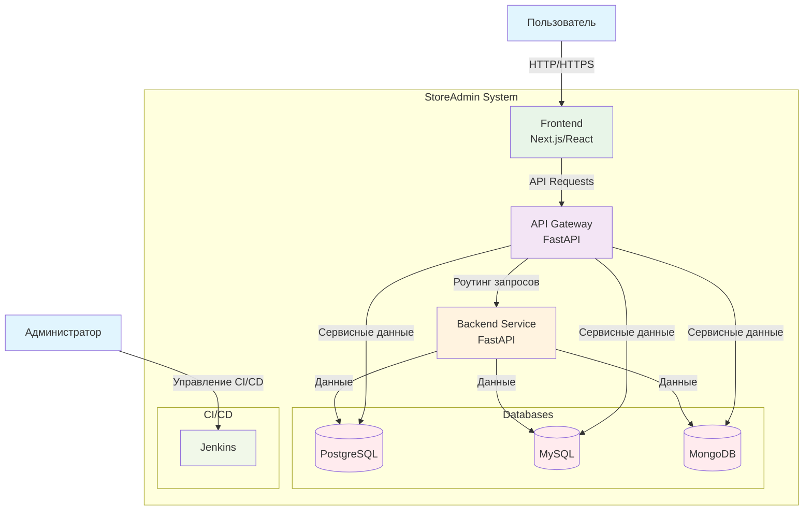

```mermaid
graph TB
    subgraph "StoreAdmin System"
        Gateway[API Gateway<br/>FastAPI]
        Frontend[Frontend<br/>Next.js/React]
        Backend[Backend Service<br/>FastAPI]
        
        subgraph "Databases"
            PG[(PostgreSQL)]
            MY[(MySQL)]
            MG[(MongoDB)]
        end
        
        subgraph "CI/CD"
            Jenkins[Jenkins]
        end
    end
    
    User[Пользователь] 
    Admin[Администратор]
    
    User -- "HTTP/HTTPS" --> Frontend
    Admin -- "Управление CI/CD" --> Jenkins
    
    Frontend -- "API Requests" --> Gateway
    Gateway -- "Роутинг запросов" --> Backend
    Backend -- "Данные" --> PG
    Backend -- "Данные" --> MY
    Backend -- "Данные" --> MG
    
    Gateway -- "Сервисные данные" --> PG
    Gateway -- "Сервисные данные" --> MY
    Gateway -- "Сервисные данные" --> MG
    
    style User fill:#e1f5fe
    style Admin fill:#e1f5fe
    style Gateway fill:#f3e5f5
    style Frontend fill:#e8f5e8
    style Backend fill:#fff3e0
    style PG fill:#ffebee
    style MY fill:#ffebee
    style MG fill:#ffebee
    style Jenkins fill:#f1f8e9
```